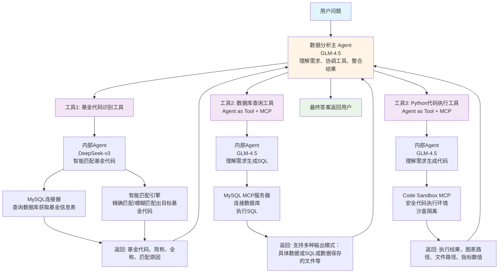
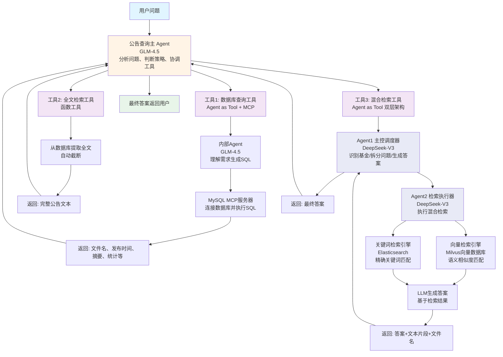
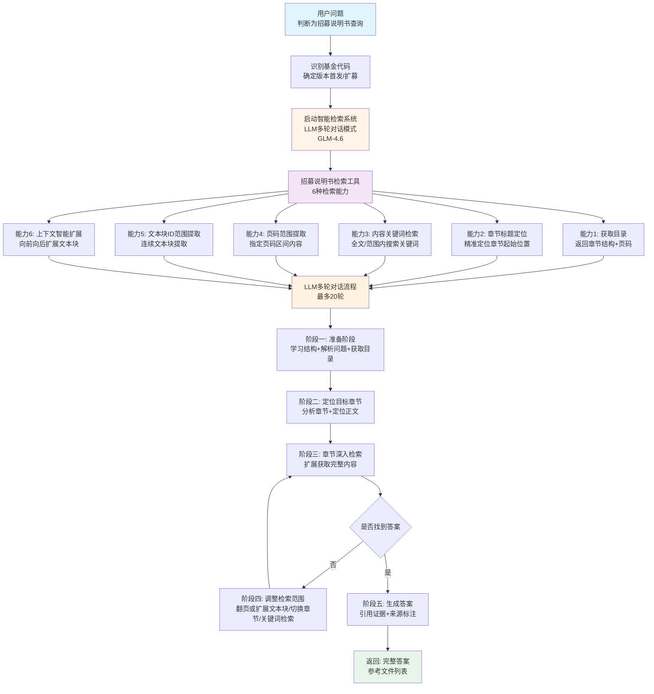
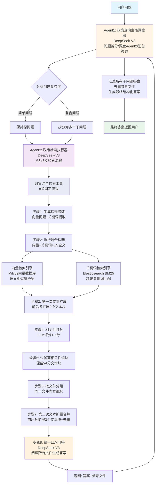

# 中国基础设施公募REITs多智能体分析系统

本项目是基于 OpenAI Agent 框架的多智能体项目，是公募 REITs 专属 AI 智能查询平台，提供多板块公募 REITs 信息查询服务。大模型选用 glm-4.5、deepseek-v3、deepseek-r1 等。

## 🌐 在线体验

**前端应用地址**: [www.reitschat.com.cn](https://www.reitschat.com.cn)

## 📊 四大功能查询板块详解

### 1. 📈 二级市场数据查询分析

#### 数据范围
包含已上市公募 REITs、中证 REITs 全收益指数的价格数据

#### 功能类型
- 查询特定 REITs 价格数据
- 基于价格数据的指标计算（涨跌幅、波动率等）
- 智能绘制图表
- 生成 excel、csv 等多种格式文件

#### 系统架构



**系统分层结构：**

**第一层：用户问题**
- 用户以自然语言提出关于 REITs 二级市场数据的问题

**第二层：数据分析主 Agent**
- 使用模型：GLM-4.5
- 核心职责：
  - 理解和分析用户意图
  - 自主决策工具调用顺序
  - 协调三大工具完成任务
  - 整合各工具返回结果
  - 生成最终用户答案

**第三层：三大智能工具**

**工具1：基金代码识别工具** 
- 功能描述：智能识别和匹配用户问题中涉及的基金代码
- 使用模型：DeepSeek-v3
- 二级组件：
  - MySQL 数据库连接器：查询数据库中的基金信息表
  - 智能匹配引擎：支持精确匹配、模糊匹配、智能推理
- 返回给主 Agent：
  - 匹配到的基金代码（如 "508056.SH"）
  - 基金简称和全称
  - 匹配原因说明

**工具2：数据库查询工具** (Agent as Tool + MCP)
- 功能描述：查询数据库获取 REITs 价格数据、指数数据等二级市场数据
- 工具类型：Agent as Tool + MCP 服务器
- 使用模型：GLM-4.5
- 查询数据库：数据库中的价格数据相关表
- 二级组件：
  - MySQL MCP 服务器：提供数据库连接和执行SQL能力
- **内部工作流程**：
  1. LLM进行问题分析，生成SQL语句
  2. LLM调用MySQL MCP服务器执行SQL
  3. LLM进行数据验证
  4. LLM调用MySQL MCP服务器保存文件(如需)
  5. LLM按照要求进行结果格式化
  6. LLM进行结果汇总
- 返回给主 Agent：
  - 根据模式不同返回：自然语言描述答案/CSV文本数据/查询出的数据所保存的文件路径/SQL语句

**工具3：Python 代码执行工具** (Agent as Tool + MCP)
- 功能描述：编写并执行 Python 代码进行数据处理、计算、可视化、文件保存等
- 工具类型：Agent as Tool + MCP 服务器
- 使用模型：GLM-4.5
- 二级组件：
  - Code Sandbox MCP 服务器：提供安全的代码执行环境
- 支持功能：
  - 数据清洗和处理
  - 统计指标计算（波动率、收益率、相关性等）
  - 数据可视化（折线图、柱状图、散点图等）
  - 文件生成（Excel、CSV、图片等）
- **内部工作流程**：
  1. LLM进行问题分析，生成Python代码
  2. LLM调用Code Sandbox MCP 服务器创建环境、运行代码、保存文件（如需）
  3. LLM进行代码执行后的结果分析
  4. LLM按照要求进行结果汇总
- 返回给主 Agent：
  - 代码执行结果
  - 生成的图表文件路径
  - 生成的数据文件路径
  - 计算得出的指标数值

#### 工作流程

该板块的工作流程根据用户问题的不同而灵活变化，主 Agent 会自主决策工具的调用顺序和组合。以下是几种典型场景：

**场景1：简单价格查询**
```
用户提问 → 主Agent分析 → 调用工具1(识别基金) → 调用工具2(查询数据) → 返回结果
```
示例："508056.SH 最近一周的收盘价是多少？"
1. 主 Agent 识别到需要查询价格
2. 调用基金代码查询工具确认基金代码为 "508056.SH"
3. 调用数据库查询工具获取该基金最近一周的收盘价数据
4. 主 Agent 整理数据并以自然语言返回给用户

**场景2：复杂指标计算**
```
用户提问 → 主Agent分析 → 调用工具1 → 调用工具2(获取原始数据) → 调用工具3(计算指标) → 返回结果
```
示例："计算中金普洛斯 REIT 最近三个月的波动率"
1. 主 Agent 识别到需要计算波动率
2. 调用基金代码查询工具识别出基金代码
3. 调用数据库查询工具获取三个月的价格数据（CSV格式）
4. 调用 Python 执行工具，生成并执行波动率计算代码
5. 主 Agent 返回计算结果

**场景3：数据可视化**
```
用户提问 → 主Agent分析 → 调用工具1 → 调用工具2 → 调用工具3(生成图表) → 返回图表文件路径
```
示例："绘制 180301.SZ 和 508089.SH 今年以来的收盘价对比图"
1. 主 Agent 识别到需要多只基金的对比图表
2. 调用基金代码查询工具确认两只基金的代码
3. 调用数据库查询工具获取两只基金今年的收盘价，数据保存至CSV文件（或仅返回SQL）
4. 调用 Python 执行工具读取上一步的CSV文件、生成对比图表（或代码中直接用SQL获取数据并生成对比图表）
5. 主 Agent 返回生成的图表文件路径

**场景4：生成数据文件**
```
用户提问 → 主Agent分析 → 调用工具1 → 调用工具2 → 调用工具3(生成文件) → 返回文件路径
```
示例："生成一个 Excel 文件，包含所有产业园 REITs 的最新价格和涨跌幅"
1. 主 Agent 识别到需要批量查询并生成文件
2. 调用基金代码查询工具识别所有产业园类型的 REITs的基金代码
3. 调用数据库查询工具获取这些基金的最新数据，数据保存至CSV文件（或仅返回SQL）
4. 调用 Python 执行工具读取上一步的CSV文件、生成包含计算涨跌幅的 Excel 文件（或代码中直接用SQL获取数据、生成包含计算涨跌幅的 Excel 文件）
5. 主 Agent 返回生成的文件路径

**特点总结：**
- 主 Agent 具有完全的自主决策能力
- 工具调用顺序灵活，根据任务需求动态组合
- 三大工具相互配合，形成完整的数据分析链条
- 支持从简单查询到复杂分析的全流程任务

---

### 2. 📢 公告信息一键获取

#### 数据范围
覆盖全部公募 REITs 已发布的公告内容

#### 功能类型
- 概括特定时间段发布的公募 REITs 公告信息
- 查询特定 REITs 特定公告中的具体信息
- 提取公告中的关键数据和条款

#### 系统架构



**系统分层结构：**

**第一层：用户问题**
- 用户以自然语言提出关于公告信息的问题

**第二层：公告查询主 Agent**
- 使用模型：GLM-4.5
- 核心职责：
  - 分析用户问题的复杂程度和类型
  - 判断采用检索方式
  - 自主决策工具调用顺序（必须先调数据库工具）
  - 整合多个工具的返回结果
  - 生成完整准确的答案

**第三层：三大智能工具**

**工具1：数据库查询工具** (Agent as Tool + MCP)
- 功能描述：查询数据库获取公告文件的元信息
- 工具类型：Agent as Tool + MCP 服务器
- 使用模型：GLM-4.5
- 二级组件：
  - MySQL MCP 服务器：连接数据库并执行SQL
- 数据库表结构：
  - 主要查询表：公告文件信息表等
- 支持多种返回模式：
  - 自然语言模式：返回易读的描述性结果
  - 原始数据 CSV 模式：返回结构化数据供进一步处理
- 返回给主 Agent：
  - 公告文件的完整文件名
  - 公告发布时间
  - 公告摘要信息
  - 符合条件的公告数量统计

**工具2：全文检索工具** (函数工具)
- 功能描述：获取指定公告文件的完整文本内容
- 工具类型：直接函数调用
- 工作原理：
  - 根据文件名从数据库提取完整公告文本
  - 自动截断超长内容
- 适用场景：
  - 需要阅读整个公告内容进行总结分析
  - 公告篇幅不是特别长的情况
- 返回给主 Agent：
  - 公告的完整文本内容（或截断后的内容）
  - 文件名和基本信息

**工具3：混合检索工具** (内部为完整的两层架构)
- 功能描述：对公告内容进行精准的问答式检索
- 工具类型：直接函数调用（内部包含两层系统）
- **内部架构：**

  **Agent1（主控调度器）- 使用 DeepSeek-V3**
  - 识别基金代码
  - 将用户问题拆分为多个子问题
  - 组织查询参数
  - 生成最终答案

  **Agent2（检索执行器）- 使用 DeepSeek-V3**
  - 执行具体的检索任务
  - 汇总检索结果

- **检索技术（Agent2 的二级工具）：**
  - 向量检索：基于语义相似度匹配相关文本块
  - Elasticsearch关键词检索：基于精确关键词匹配

- **检索流程：**
  1. Agent1 接收主 Agent 的查询请求
  2. Agent1 识别问题中的基金代码
  3. Agent1 将复杂问题拆分为若干子问题
  4. Agent1 将子问题交给 Agent2 执行
  5. Agent2 调用混合检索技术（向量+ES）找到相关文本块并进行扩展
  6. Agent2 使用 LLM 基于检索结果生成答案
  7. Agent1 汇总所有子问题的答案，生成最终结果

- 返回给主 Agent：
  - 针对用户问题的精确答案
  - 相关公告的文件名

#### 工作流程

公告查询主 Agent 的核心原则是**必须先调用数据库查询工具了解公告信息，再根据需要调用其他工具**。以下是典型场景：

**场景1：公告概括查询**
```
用户提问 → 主Agent分析 → 调用工具1(数据库查询) → 返回结果
```
示例："508086.SH 最近半年发布了哪些重要公告？"
1. 主 Agent 识别为公告整体情况查询
2. 调用数据库查询工具，要求返回自然语言模式
3. 数据库工具返回近半年公告列表，包含文件名、发布时间、摘要
4. 主 Agent 整理并返回给用户，附带公告链接

**场景2：公告具体内容查询（短篇公告）**
```
用户提问 → 主Agent → 工具1(获取文件名) → 工具2(获取全文) → 主Agent分析 → 返回答案
```
示例："请问中银仓储物流 REIT 最新的分红公告中的分红方案是什么？"
1. 主 Agent 识别为内容检索导向，但需要先获取文件信息
2. 调用数据库查询工具获取最新分红公告的文件名
3. 调用全文检索工具获取该公告的完整文本（因公告较短）
4. 主 Agent 从全文中提取分红方案信息
5. 返回具体的分红方案内容

**场景3：公告具体内容查询（跨公告或长篇公告）**
```
用户提问 → 主Agent → 工具1(查询文件列表) → 工具3(混合检索) → 返回答案
```
示例："中金普洛斯 REIT 最新的评估报告中的评估结果是多少？"
1. 主 Agent 识别为复杂的内容检索任务
2. 调用数据库查询工具获取该基金目标公告文件
3. 调用混合检索工具获取答案
4. 主 Agent 返回答案

---

### 3. 📑 招募说明书信息解析

#### 数据范围
囊括全部公募 REITs 的招募说明书文本信息（包括首发版和扩募版）

#### 功能类型
- 查询招募说明书中的特定章节内容
- 提取招募说明书中的关键数据和条款
- 对比分析招募说明书中的多项信息

#### 系统概述

该系统采用 **LLM 多轮对话 + 工具调用** 的方式，模拟人类阅读招募说明书的过程。

#### 整体流程图



#### 智能检索工具能力

招募说明书检索工具是一个功能强大和灵活的工具，采用模拟人类阅读招募说明书这类内容较长的公告文件时的方式，支持多种能力：

**1. 获取招募说明书目录**
- 参数：`search_info="目录"`
- 返回：完整的招募说明书目录结构，包含章节标题和页码

**2. 章节标题精准定位**
- 参数：`search_info="章节标题检索：第X部分 章节名称"`
- 功能：根据目录中的章节标题定位到该章节的起始位置
- 配合：`expand_after` 参数可获取章节后续内容

**3. 内容关键词检索**
- 参数：`search_info="内容检索：关键词"`
- 功能：在招募说明书全文或指定范围内搜索包含关键词的文本块
- 返回：最多20条相关文本块，每条带页码和文本块ID
- 配合：`expand_before` 和 `expand_after` 参数扩展上下文

**4. 页码范围提取**
- 参数：`start_page=X, end_page=Y, search_info=""`
- 功能：提取指定页码范围内的所有文本内容
- 适用：已知目标信息所在页码范围

**5. 文本块ID范围提取**
- 参数：`start_chunk_id=X, end_chunk_id=Y, search_info=""`
- 功能：连续提取指定文本块ID范围的内容
- 适用：需要往后扩展获取更多章节内容

**6. 上下文智能扩展**
- 参数：`expand_before=N, expand_after=M`
- 功能：在检索结果的基础上，向前扩展N个文本块，向后扩展M个文本块
- 用途：获取完整的上下文信息


#### 人类式检索流程详解

LLM 在多轮对话中模拟人类阅读招募说明书的思维过程，遵循以下流程：

**阶段一：准备阶段**
1. **学习招募说明书结构**
   - LLM 首先学习招募说明书的通用结构（系统提供参考章节要点）
   - 了解各章节的常见内容和排布顺序

2. **解析用户问题**
   - 识别问题中的基金代码（如 "508056.SH"）
   - 判断适用的招募说明书版本（首发/扩募）

3. **第一轮工具调用：获取目录**（必须执行）
   - 调用参数：`fund_code="508056.SH", search_info="目录"`
   - 目的：了解该基金招募说明书的具体章节结构和页码

**阶段二：定位目标章节**
4. **分析目标章节**
   - 对照获取的目录和参考章节要点
   - 推断用户问题对应的目标章节
   - 示例：问题"基础设施项目最近三年的EBITDA是多少？"
     → 判断属于"基础设施项目基本情况"章节

5. **定位章节正文**（两种方法）

   **方法1：基于页码范围提取**
   - 适用：目录提供了明确的页码信息
   - 策略：
     - 如果下一章节页码 - 当前章节页码 ≤ 100页
       → 一次性获取整个章节：`start_page=当前页码, end_page=下一章节页码+30`
     - 如果页码差 > 100页
       → 分批获取：`start_page=当前页码, end_page=当前页码+100`，后续再扩展
   - 调用示例：`start_page=50, end_page=120, search_info=""`

   **方法2：基于章节标题检索**
   - 适用：目录无页码或方法1失败
   - 调用示例：`search_info="章节标题检索：第十四部分 基础设施项目基本情况", expand_after=5`
   - 风险：可能定位到对该章节的引用而非正文，需验证

**阶段三：章节深入检索**（如需要）
6. **扩展章节内容**
   - 触发条件：首轮未提取完整章节或未覆盖目标信息
   - 扩展方法：按文本块ID连续提取或按页码范围提取按页码范围提取

**阶段四：调整检索范围**（如需要）
1. **切换章节或使用关键词检索**

   **情况1：确定其他章节可能有答案**
   - 重新定位新的目标章节
   - 重复阶段二和阶段三的流程

   **情况2：无法准确判断目标章节**
   - 使用内容关键词检索
   - 调用示例：`search_info="内容检索：EBITDA", expand_before=1, expand_after=1`
   - 返回：最多20条包含关键词的文本块
   - 后续：
     - 从返回结果中找出最可能的文本块
     - 根据其 `chunk_id` 或页码进一步扩展获取完整信息

   **限定范围的关键词检索**
   - 可根据已知信息限定检索范围进行关键词检索，如范围不确定则全文检索

**阶段五：生成答案**
1. **汇总结果**
   - LLM 基于所有检索到的文本内容
   - 引用具体的证据和来源（如章节标题、表格标题）
   - 生成完整准确的答案
   - 如信息不足，说明缺口并给出建议

#### 技术特点

- **LLM 自主决策**：由 LLM 完全控制检索流程
- **工具调用灵活**：支持多种检索方式的组合使用
- **模拟人类思维**：按照人类阅读文档的逻辑进行检索
- **迭代优化**：根据每一轮结果动态调整检索策略
- **精准定位**：结合目录、章节、关键词多维度定位信息

---

### 4. ⚖️ 政策法规精准查询

#### 数据范围
收录公募 REITs 相关政策法规文件内容（证监会、交易所、发改委等权威机构）

#### 功能类型
- 查询特定政策规定和要求
- 提取政策文件中的具体条款
- 对比分析多项政策规定

#### 系统架构

该板块是一个固定流程的检索系统，采用 **Agent1（问题拆分） + Agent2（执行检索）** 的两层架构。



#### 完整工作流程

**步骤1：问题分析与拆分（Agent1）**
- Agent1 接收用户的政策问题
- 分析问题复杂度：
  - 简单问题（单一查询点）→ 保持原问题
  - 复合问题（多个查询点）→ 拆分为多个子问题

**步骤2：调用 Agent2 执行检索**
- Agent1 将所有子问题传递给 Agent2
- Agent2 对每个子问题独立执行 8 步检索流程（详见下文）
- Agent2 返回每个子问题的检索结果

**步骤3：最终答案生成（Agent1）**
- Agent1 接收 Agent2 返回的所有结果
- 汇总整合多个子问题的答案
- 去重和整理参考文件列表
- 生成结构化的最终答案

#### Agent2 的 8 步检索流程

Agent2 内部使用 **政策混合检索工具**，该工具执行严格的 8 步流程：

**步骤1：生成检索参数**
- 输入：用户的子问题
- 处理：
  - 生成优化的向量检索问题（语义匹配用）
  - 提取关键词列表（精确匹配用）

**步骤2：执行混合检索**
- 同时使用两种检索技术：
  - **向量检索**：基于语义相似度在 Milvus 向量数据库中检索
  - **关键词检索**：基于关键词在 Elasticsearch 中检索
- 合并检索结果，去重
- 返回：相关的政策文本块列表

**步骤3：第一次文本扩展**
- 对每个检索到的文本块进行上下文扩展
- 目的：获取更完整的上下文信息，避免信息片段化

**步骤4：相关性打分**
- 使用 LLM（DeepSeek-V3）对每个扩展后的文本块进行相关性评分

**步骤5：过滤高相关性语块**
- 保留评分高的文本块


**步骤6：按文件分组**
- 将保留的高分文本块按照来源文件分组
- 目的：将同一政策文件的多个文本块组织在一起

**步骤7：第二次文本扩展与合并**
- 对每个文件组内的文本块进行进一步扩展，这一步扩展的文本块数量更大
- 文本块合并、去重、按顺序排列

**步骤8：统一 LLM 问答**
- 将所有文件组的内容一起提供给 LLM（DeepSeek-V3）进行作答


## 🎬 功能演示

### 📈 二级市场数据查询分析


### 📢 公告信息一键获取  


### 📑 招募说明书信息解析


### ⚖️ 政策法规精准查询


## 🚀 快速开始

### 环境要求
- Python 3.8+
- MySQL 数据库
- Milvus 向量数据库
- Elasticsearch

### 安装与运行

1. 克隆本仓库并安装依赖：
   - `pip install -r requirements.txt`
2. 复制 `.env.example` 为 `.env`，填写数据库、向量库、Elasticsearch 以及各模型 API Key：
   - `cp .env.example .env`
3. 运行你需要的 Agent 或调用相应的工具（示例见 `kr_agents/`）。

## 🏗️ 项目结构

```
agent/
├── kr_agents/              # 四大核心智能体
├── business_tools/         # 业务工具层
├── config/                 # 配置管理（从环境变量/.env 读取）
├── finetune/               # 招募说明书检索板块中的智能检索工具
├── database/               # 数据库与 MCP 工具
├── retrieval_engine/       # 检索引擎（全文/混合）
├── mcp_servers/            # MCP 服务器（code-sandbox、MySQL 等）
├── docker/                 # Dockerfile 与运行辅助
├── mp4/                    # 演示视频
├── utils/                  # 工具库
├── requirements.txt
└── README.md
```

联系方式：412447958@qq.com
